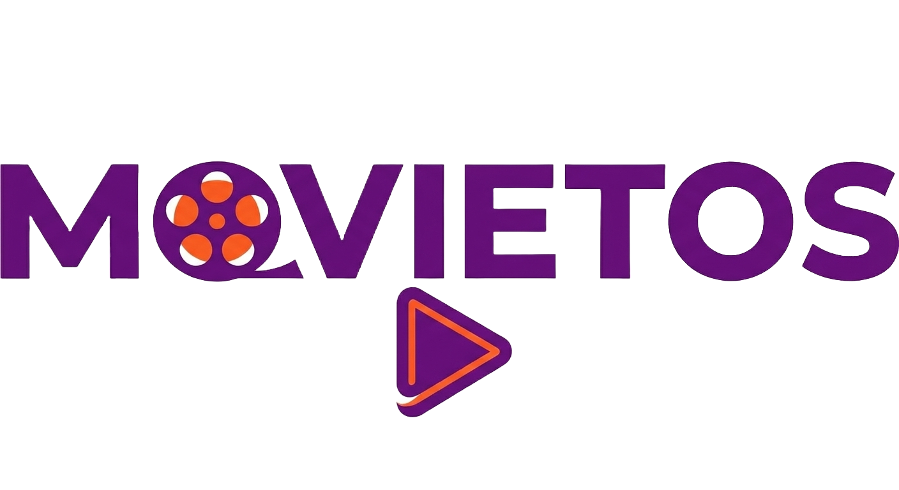

<h1 align="center">Ahmad Hisham</h1>
<h3 align="center">Frontend Developer • UI/UX Designer • Modern Web Interfaces</h3>

  

  
  
  

---

## 👨‍💻 About Me

- 🎓 **Information Technology Institute (ITI) Graduate**
- 💡 Frontend-focused developer with a strong base in **JavaScript & React**
- 🧠 Actively building **real-world projects** and preparing for **MERN roles**
- 🎯 Passionate about **clean UI, maintainable code, and performance**

---

## 🚀 Currently Working With

  
  
  
  
  

---

## 🛠 Tech Stack

### 🌐 Frontend

  
  
  
  
  
  
  

  

### ⚙️ Backend & Tools

  
  
  
  
  

---

## 📊 GitHub Analytics

  

---

## 📌 Featured Projects

  <table>
    <tr>
      <td align="center">
        
         
        <strong>Movietos</strong>
         
        Movie app (React + TMDB API integration with search & filtering + Tailwindcss)
      </td>
      <td align="center">
        
         
        <strong>Karakib</strong>
         
        Waste Recycling Website (Vue + PHP + Tailwindcss + Gemini AI Chatbot)
      </td>
      <td align="center">
        
         
        <strong>PropertyXpert</strong>
         
        RealEstate Website (React + Tailwindcss)
      </td>
      <td align="center">
        
         
        <strong>Horus</strong>
         
        E-commerce Website (Under development)
      </td>
    </tr>
  </table>

---

## 📫 Get in Touch

-  **LinkedIn:** https://www.linkedin.com/in/ahmad-hisham-a942a6221/
-  **Email:** ahmadhisham5555@gmail.com

---

  <em>Building interfaces that are simple, scalable, and user-focused.</em>

